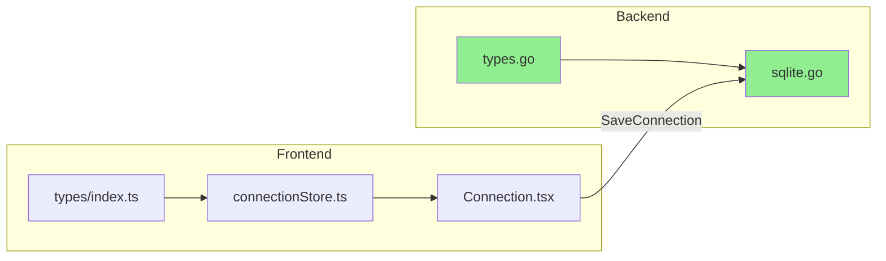

# 連線命名功能

## 修改範圍

需要修改 **3 個前端檔案**，後端已有支援不需修改。




綠色 = 已支援，不需修改

---

## 檔案修改清單

### 1. [frontend/src/types/index.ts](frontend/src/types/index.ts)

**修改內容**：`Connection` 介面加入 `name` 欄位（可選）

```typescript
// 第 12-20 行，加入 name
export interface Connection {
  id: string;
  name?: string;  // 新增，可選欄位
  connectionString: string;
  connectionType: ConnectionType;
  // ...
}
```

---

### 2. [frontend/src/stores/connectionStore.ts](frontend/src/stores/connectionStore.ts)

**修改內容**：

- 第 85 行：`name: ''` 改為傳入 `connection.name`
- 第 119 行：loadConnections 時讀取 `config.name`
- 第 181-193 行：recordTestedConnection 加入 name 參數

---

### 3. [frontend/src/pages/Connection.tsx](frontend/src/pages/Connection.tsx)

**修改內容**：

- 新增 `connectionName` state（預設空字串）
- 測試成功後顯示名稱輸入框（在「保留連線」按鈕前）
- handleKeepConnection 傳入 name（可為空）
- 已儲存連線列表顯示名稱（如有）

**UI 設計**：

- 名稱輸入框為**選填**，不設 required
- placeholder 顯示「選填」或「Optional」
- 如未填名稱，列表顯示 connectionString 前幾個字元或 database 名稱

**UI 位置**：在選擇資料庫後、「保留連線」按鈕前加入：

```
[資料庫類型選擇]
[連線字串輸入]
[測試連線按鈕]
[測試結果]
  ├── [選擇資料庫]
  ├── [連線名稱輸入（選填）] ← 新增
  └── [保留連線按鈕]
```

**顯示邏輯**：

- 有名稱：顯示名稱
- 無名稱：顯示 `[MSSQL] selectedDatabase` 或 connectionString 前 30 字元

---

## 不需修改

- `internal/types/types.go` - 已有 `Name` 欄位（第 16 行）
- `internal/storage/sqlite.go` - 已有存取 `name`（第 177, 194 行）
- `app.go` - 已透傳 `Name`

